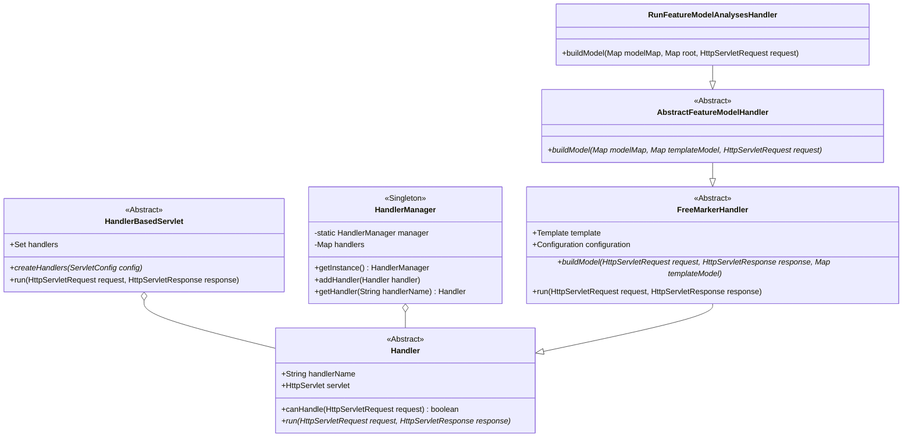

# SPLOT - Feature Model Analysis Tool

This document provides a comprehensive overview of the SPLOT project, including its architecture, main components, and the design patterns used in its implementation.

Author: [Marcilio Mendonca](https://github.com/marcilio)

## Architecture

The SPLOT project is a Java web application built on a custom, lightweight, servlet-based framework. The architecture is layered, with a clear separation of concerns between the core framework and the application services.

### Architecture Diagram (Services)

```mermaid
graph TD
    subgraph "Client"
        A[Browser]
    end

    subgraph "Web Server"
        B[HandlerBasedServlet]
    end

    subgraph "Core Framework (SPLOT.core)"
        C[HandlerManager]
        D{Handler}
        E[FreeMarkerHandler]
    end

    subgraph "Application Services (SPLOT.services)"
        F[AbstractFeatureModelHandler]
        G[RunFeatureModelAnalysesHandler]
        H[...]
    end

    A --> B
    B --> C
    C --> D
    B --> D
    D --|> E
    E --|> F
    F --|> G
    F --|> H
```

**Description:**

1.  The client (browser) sends an HTTP request to the web server.
2.  The `HandlerBasedServlet` receives the request.
3.  The servlet uses the `HandlerManager` to find the appropriate `Handler` to process the request based on the `action` parameter.
4.  The `Handler` processes the request and generates a response.
5.  The application services, such as `RunFeatureModelAnalysesHandler`, extend the core framework's handlers to provide specific functionality for feature model analysis.

## Class Diagram

The following class diagram illustrates the main interfaces, abstract classes, and concrete classes in the SPLOT project.



## Gang of Four Design Patterns

The SPLOT project utilizes several Gang of Four (GoF) design patterns to achieve a flexible and maintainable architecture.

*   **Chain of Responsibility:** The `HandlerBasedServlet` iterates through a list of `Handler` objects, and the first one that can handle the request is executed. This pattern decouples the sender of a request from its receiver, giving more than one object a chance to handle the request.

*   **Command:** The `Handler` class encapsulates a request as an object, thereby letting you parameterize clients with different requests, queue or log requests, and support undoable operations.

*   **Template Method:** The `FreeMarkerHandler` and `AbstractFeatureModelHandler` classes define the skeleton of an algorithm in their `run` and `buildModel` methods, respectively. They let subclasses redefine certain steps of the algorithm without changing the algorithm's structure.

*   **Singleton:** The `HandlerManager` class ensures that only one instance of the class is created and provides a global point of access to it.
